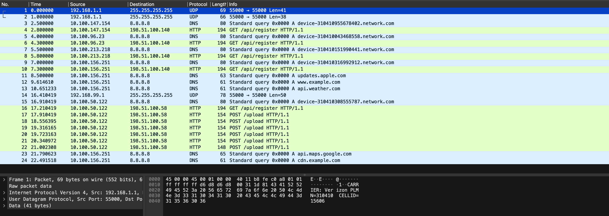

# Rogue Tower

> **Event:** cylabacademy · **Category:** forensics

## Challenge

A packet capture, `rogue_tower.pcap`. Find the flag.

## TL;DR

One device associates with a tower broadcasting **PLMN 00101** — the reserved
test-network code IMSI catchers use — then exfiltrates base64 across six HTTP
POSTs. Decoded it's XOR ciphertext. The key is the last 8 digits of the device's
IMSI, but you never need to work that out: XORing the ciphertext against the
known `picoCTF{` prefix hands you the key directly.

## Approach

### 1. Survey the capture



Most devices do the same three things: UDP broadcast on port 55000, DNS lookup
for `device-<digits>.network.com`, then `GET /api/register` to
**198.51.100.140**. Packets 17–22 break that — `POST /upload`, to a different
host, **198.51.100.58**.

### 2. Find the rogue tower

```bash
tcpdump -r rogue_tower.pcap -A -n 'udp port 55000'
```

```
192.168.1.1  > 255.255.255.255: CARRIER: Verizon PLMN=310410 CELLID=15606
192.168.1.1  > 255.255.255.255: CARRIER: AT&T PLMN=310410 CELLID=15607
192.168.99.1 > 255.255.255.255: UNAUTHORIZED-TEST-NETWORK PLMN=00101 CELLID=92058
```

Two real carriers from `192.168.1.1`, then a third beacon from a different
source announcing **PLMN 00101**. MCC 001 / MNC 01 is reserved for test
networks — never a commercial carrier.

### 3. Identify the compromised phone

```bash
tcpdump -r rogue_tower.pcap -A -n 'host 198.51.100.58'
```

```
GET /api/register HTTP/1.1
User-Agent: MobileDevice/1.0 (IMSI:310410308555787; CELL:92058)
```

`CELL:92058` is the rogue tower's CELLID — that's the association, and the IMSI
is handed over in the same header. A normal device shows `CELL:15606`.

### 4. Reassemble the payload

Six POST bodies, 9 base64 characters each and a final 3:

```
QFFWWnZjf  kxCCFJABm  hbBFxUakE  FQAtFb1xX  VgEHAAQBR  Q==
```

Base64 decodes in 4-character groups, so no fragment is valid alone — the chunk
size forces reassembly.

```
QFFWWnZjfkxCCFJABmhbBFxUakEFQAtFb1xXVgEHAAQBRQ==
```

<details>
<summary>What didn't work here</summary>

**Tried:** decoding that and reading it. **Why it failed:** it decodes cleanly to
34 bytes of binary garbage. That combination is the tell — malformed base64 means
you reassembled wrong, but *well-formed* base64 decoding to non-text means the
base64 was only transport and something encrypted it first.

**Tried:** online decryption tools with the IMSI as a "private key". **Why it
failed:** nothing here is asymmetric — no keypair, no handshake. The hint meant
the IMSI is symmetric key material.

</details>

### 5. Recover the key from known plaintext

If `c = p ^ k` then `k = c ^ p`, so any plaintext you already know reveals the
key under it — and every flag starts `picoCTF{`.

```python
import base64

ct = base64.b64decode("QFFWWnZjfkxCCFJABmhbBFxUakEFQAtFb1xXVgEHAAQBRQ==")
key = bytes(c ^ p for c, p in zip(ct, b"picoCTF{"))
print(key)          # b'08555787'


def xor(data: bytes, key: bytes) -> bytes:
    return bytes(b ^ key[i % len(key)] for i, b in enumerate(data))


print(xor(ct, key))
```

`08555787` is the last 8 digits of IMSI `310410308555787` — meaningful bytes
rather than noise, which is what confirms the attack worked.

## Flag

```
picoCTF{r0gu3_c3ll_t0w3r_...}
```

_Truncated — graded course._

## Learn more

The crib attack skips the puzzle. The hint invites you to guess *how* the IMSI
becomes a key — all 15 digits? the last 8? hashed? XOR leaks the key to anyone
holding eight bytes of plaintext, so you recover it first and notice what it
spells afterwards.

The limit: an *n*-character crib recovers exactly *n* key bytes. Here the key was
8 bytes and `picoCTF{` is 8 characters, so one pass got all of it. A longer key
would decode the first 8 characters correctly and turn to noise after — a partial
success that looks like a bug. The fix is a longer crib.

Also worth noting: `^` works on ints, not `bytes`, hence the helper. And the
uploads run plaintext HTTP over **port 443** to a different IP than every
legitimate registration — both visible without decoding anything.

- [ITU-T E.212](https://www.itu.int/rec/T-REC-E.212) — the assignments reserving 001/01

## Tools

Wireshark, `tcpdump -A`, Python
