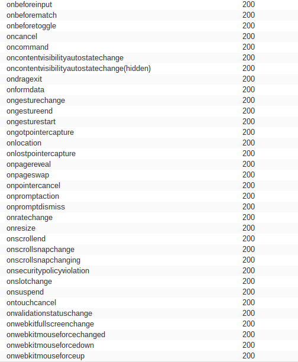

# Reflected XSS into HTML context with most tags and attributes blocked

> **Event:** portswiggeracademy · **Category:** xss

## Challenge

> This lab contains a reflected XSS vulnerability in the search functionality but
> uses a web application firewall (WAF) to protect against common XSS vectors. To
> solve the lab, perform a cross-site scripting attack that bypasses the WAF and
> calls the `print()` function.

The `search` parameter reflects into HTML, but a WAF blocks almost every tag and
attribute. The job is to find the few that slip through and chain them into a
firing event.

## TL;DR

`<body>` survives the tag filter; brute-forcing attributes with Intruder shows
`onresize` survives too. `onresize` needs a resize to fire, so deliver the
payload inside an `<iframe>` and resize the frame from its `onload`. The lab's
`print()` runs in the victim's browser.

## Approach

### 1. Find a tag the WAF allows

Injecting `<script>`, ``, `<svg>`, etc. into `search` is blocked. Working
through candidate tags by hand, `<body>` gets through:

```
/?search=<body>
```

<details>
<summary>What didn't work here</summary>

**Tried:** the usual first choices — `<script>`, ``,
`<svg onload=...>`.

**Why it failed:** the WAF blocklists them by name. Tag discovery is the first of
two independent filters to beat; a tag getting reflected doesn't mean any
attribute on it will.

</details>

### 2. Find an attribute the WAF allows

With `<body>` accepted, brute-force event handlers. Send `<body%20ATTR=1>` to
Burp Intruder with `ATTR` as the payload position and load PortSwigger's [XSS
cheat sheet](https://portswigger.net/web-security/cross-site-scripting/cheat-sheet)
event-handler list. Watching response lengths / reflected-vs-blocked, `onresize`
survives:

```
/?search=<body onresize=print()>
```



But nothing fires — `onresize` only runs when the element is actually resized,
and a normal page load never resizes `<body>`.

### 3. Trigger the resize from an iframe

Host a page that loads the lab in an `<iframe>` and, once loaded, changes the
frame's width. Resizing the frame resizes the reflected `<body>`, firing
`onresize` ([files/](files/exploit.html)):

```html
<iframe src="https://YOUR-LAB-ID.web-security-academy.net/?search=<body onresize='print()'>"
        onload="this.width=500">
</iframe>
```

Store it on the exploit server and **Deliver exploit to victim** — the frame
loads, `onload` sets `width=500`, the resize fires `print()`, lab solved.

## Flag

```
print() fired in the victim's browser — lab solved
```

## Learn more

WAF-based XSS defenses are blocklists, and blocklists leak: they can't enumerate
every tag and event handler, so discovery is just a matter of iterating the
space — which is exactly what Intruder plus a cheat sheet automates. The two
filters (tags, then attributes) are independent, so both have to be probed.

The `onresize` step is the transferable trick: an event handler is useless
without something to fire it, and an attacker-controlled iframe lets you *drive*
that event — resize, focus, scroll — rather than wait for the victim to. The real
fix isn't the WAF at all; it's context-aware output encoding of the reflected
`search` value.

- [PortSwigger — XSS cheat sheet](https://portswigger.net/web-security/cross-site-scripting/cheat-sheet)

## Tools

`burp` (Intruder), exploit server
